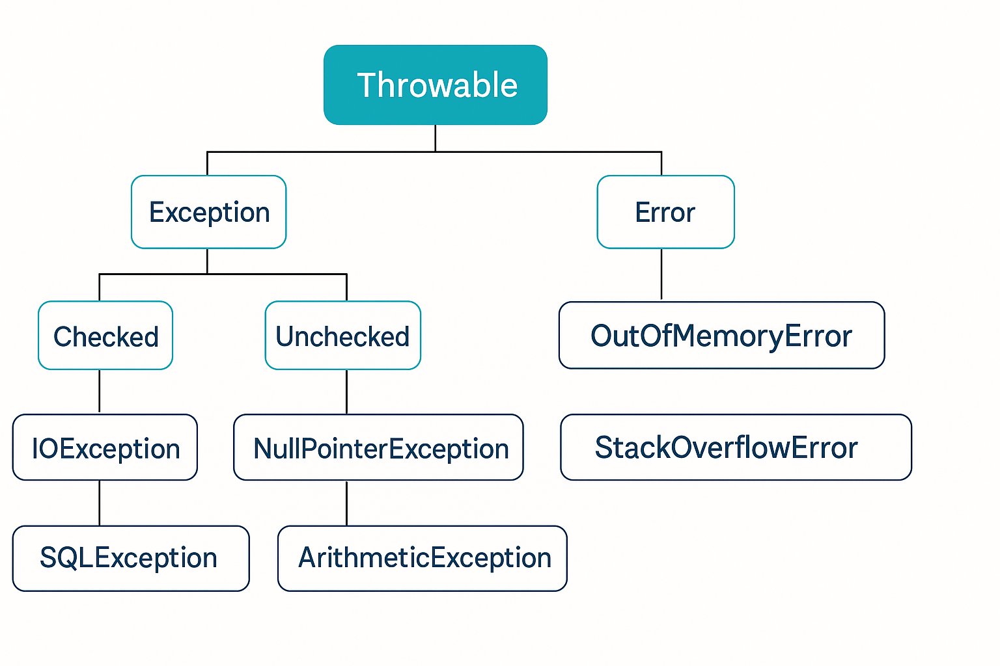

# 🚀 Exceptions in Java

## Introduction

Exceptions in Java represent **unexpected events or errors** that occur during the execution of a program. They disrupt the normal flow of instructions. Exception handling in Java provides a powerful mechanism to handle runtime errors, making programs robust and error-tolerant.

---
### 📘 Concept

#### 🏷️ What is an Exception?

* An **Exception** is an object that describes an error or an unusual condition in a program.
* It occurs at **runtime** and can be caught and handled.
* Examples: dividing by zero, accessing an invalid array index, file not found.

---

#### 🏷️ Types of Exceptions

1. **Checked Exceptions**

    * Checked at compile-time.
    * Must be either handled using try-catch or declared using `throws`.
    * Example: `IOException`, `SQLException`.

2. **Unchecked Exceptions**

    * Occur at runtime.
    * Subclasses of `RuntimeException`.
    * Example: `NullPointerException`, `ArrayIndexOutOfBoundsException`.

3. **Errors**

    * Serious issues that cannot be recovered from.
    * Example: `OutOfMemoryError`, `StackOverflowError`.

---

#### 🏷️ Try-Catch Block

* Used to handle exceptions.
* The risky code goes in the `try` block, and exception handling logic goes in the `catch` block.

#### 📝 Program

```java
public class TryCatch {
    public static void main(String[] args) {
        try {
            int result = 10 / 0; // risky code
        } catch (ArithmeticException e) {
            System.out.println("Error: Division by zero is not allowed.");
        }
    }
}
```

---

#### 🏷️ Finally Block

* The `finally` block is always executed, whether an exception is thrown or not.
* Used to release resources like files, database connections, etc.

#### 📝 Program

```java
public class FinallyDemo {
    public static void main(String[] args) {
        try {
            int arr[] = new int[3];
            arr[5] = 10; // risky code
        } catch (ArrayIndexOutOfBoundsException e) {
            System.out.println("Array index error: " + e);
        } finally {
            System.out.println("Finally block executed.");
        }
    }
}
```

---

#### 🏷️ What are Custom Exceptions?

* Sometimes, predefined exceptions are not enough.
* You can create your own exceptions to represent specific problems in your application.

---

#### 🏷️ Creating Custom Exception

* Extend the `Exception` class (for checked exception) or `RuntimeException` (for unchecked exception).

#### 📝 Program

```java
class InvalidAgeException extends Exception {
    public InvalidAgeException(String message) {
        super(message);
    }
}

public class CustomExceptionTest {
    static void validateAge(int age) throws InvalidAgeException {
        if (age < 18) {
            throw new InvalidAgeException("Age must be at least 18.");
        } else {
            System.out.println("Valid age.");
        }
    }

    public static void main(String[] args) {
        try {
            validateAge(15);
        } catch (InvalidAgeException e) {
            System.out.println("Caught exception: " + e.getMessage());
        }
    }
}
```

---

#### 🏷️ throw vs throws

1. **throw**

   * Used to **explicitly throw** an exception.
   * Used inside a method or block.
   * Can throw only one exception at a time.

   Syntax:
   
   ```
   throw new ArithmeticException("Division by zero");
   ```

2. **throws**

    * Declares the exceptions a method can throw.
    * Used in method signatures.
    * Can declare multiple exceptions.

   Syntax:

   ```java
   void myMethod() throws IOException, SQLException {
       // code
   }
   ```

---

### ✨ Summary

* **Exception Handling** makes code more robust.
* Types: Checked, Unchecked, and Errors.
* **try-catch-finally** is the core mechanism.
* You can create **custom exceptions** for application-specific errors.
* Use **throw** to explicitly throw exceptions.
* Use **throws** in method signatures to declare potential exceptions.
* Exception Framework Hierarchy:
  

---

[](../../../../../../course-docs/TABLE_CONTENT_README.md)

