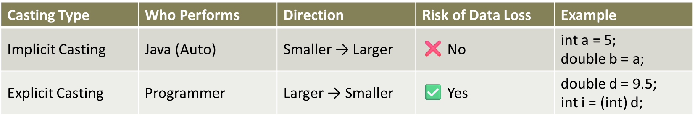

# 🚀 Type Casting in Java

Type casting in Java is the process of converting a variable from one **data type** to another.  
It is useful when you want to perform operations between different types of variables.

---

## 1. Types of Type Casting
### 📘 Concept

#### Implicit Casting (Widening)

* Converts a smaller type to a larger type.
* Done **automatically** by Java.
* Example: `int` → `long` → `float` → `double`

#### Explicit Casting (Narrowing)

* Converts a larger type to a smaller type.
* Must be done **manually** by placing the type in parentheses.
* Example: `double` → `float` → `long` → `int`



---

### 📝 Program: Implicit Casting

```java
public class ImplicitCasting {
    public static void main(String[] args) {
        int myInt = 9;
        double myDouble = myInt; // automatic casting: int to double

        System.out.println("Integer value: " + myInt);
        System.out.println("Double value: " + myDouble);
    }
}
```

Output:

```
Integer value: 9
Double value: 9.0
```

### 📝 Program: Explicit Casting

```java
public class ExplicitCasting {
    public static void main(String[] args) {
        double myDouble = 9.78;
        int myInt = (int) myDouble; // manual casting: double to int

        System.out.println("Double value: " + myDouble);
        System.out.println("Integer value: " + myInt);
    }
}
```

Output:

```
Double value: 9.78
Integer value: 9
```

### 📝 Program: Casting with Arithmetic Operations

```java
public class CastingArithmetic {
    public static void main(String[] args) {
        int a = 10;
        double b = 3.0;

        // Widening: int is promoted to double automatically
        double result1 = a + b;
        System.out.println("Result of a + b: " + result1);

        // Narrowing: explicit cast to int
        int result2 = (int) (a + b);
        System.out.println("Result after casting to int: " + result2);
    }
}
```

---

### 📌 Key Notes

* **Widening Casting** (smaller → larger type) is safe and implicit.
* **Narrowing Casting** (larger → smaller type) can lead to data loss, must be explicit.
* Casting is commonly used when working with **different numeric types** in arithmetic operations.
* Always be careful with narrowing casting to avoid **unexpected truncation**.

---

### ✨ Summary

* Type casting converts data from one type to another.
* Java supports **implicit** and **explicit** casting.
* Essential for mathematical operations, data conversions, and type compatibility.

---

[](../../../../../../README.md)

